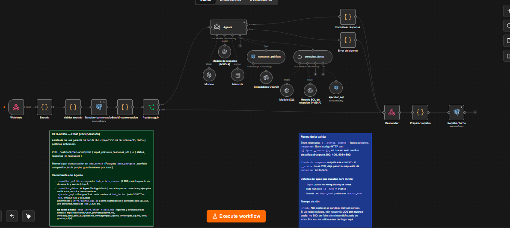
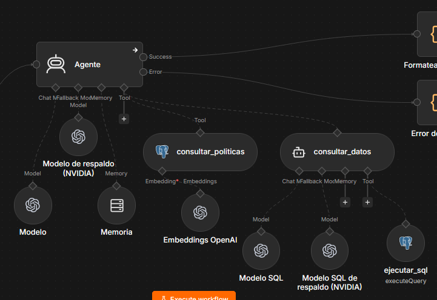
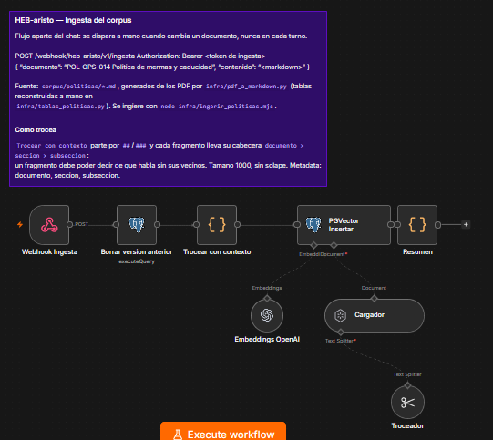
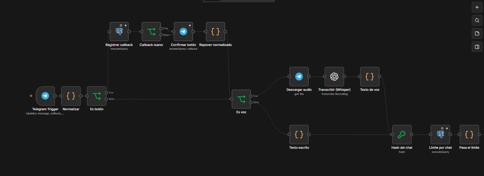
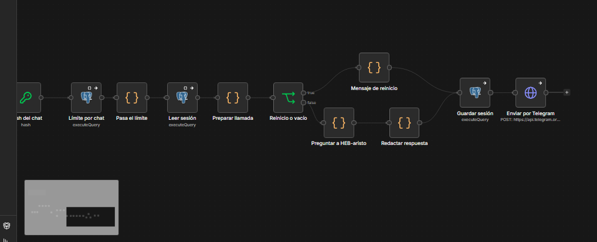
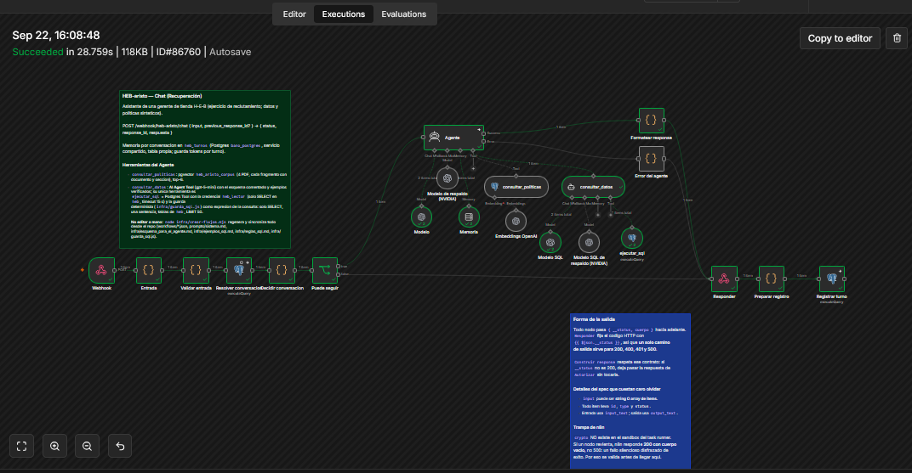
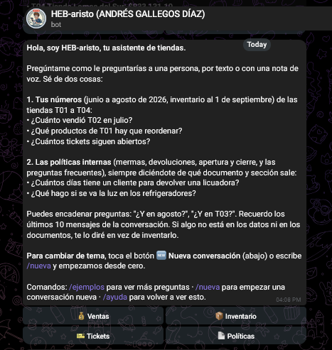
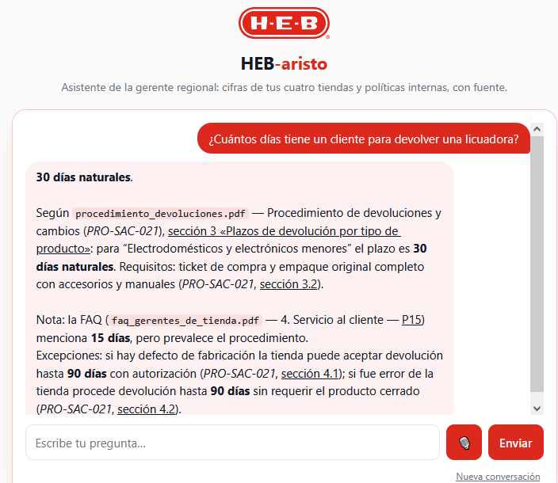

# HEB-aristo

Asistente en español para una gerente que administra cuatro tiendas H-E-B: responde **cifras** (ventas, inventario, tickets) ejecutando SQL de solo lectura sobre los datos, y **políticas** citando documento y sección de los 4 PDF internos. Cuando no tiene el dato, lo dice.

Tres flujos de n8n —**Ingesta** (PDF → Markdown con secciones reales → pgvector), **Recuperación** (el chat, con el agente SQL dentro) y **Telegram** (el canal)—, PostgreSQL 17 + pgvector y `gpt-5-mini` con respaldo NVIDIA. El razonamiento, lo descartado, cómo se midió y el costo por interacción están en [`plantilla_decisiones.md`](plantilla_decisiones.md).

## Probarlo (menos de 2 minutos, sin instalar nada)

**Canal principal: Telegram.** Abre `@HEB_aristo_bot` y pregunta por texto o con una **nota de voz**: es público, no hay que pedir acceso (los datos son sintéticos; hay un límite de 12 mensajes por cada 5 minutos y conversación). Abajo de cada respuesta aparecen botones de seguimiento (🏬 Por tienda · 📅 Por mes · 📄 Sección completa…), y el teclado fijo trae **🆕 Nueva conversación**, **❓ Ayuda** y **💡 Ejemplos**; ❓ abre un menú por secciones con preguntas listas para tocar.

**Camino alterno:** el mismo asistente en la web, **https://heb.stingai.org** — texto o voz (🎙️), sin registro. Existe por si el bot no estuviera disponible el día de la revisión.

Preguntas que muestran lo importante:

- `¿Qué pasó con las ventas de T02 del 14 al 16 de julio?` — cruza ventas + ticket 1118 + `manual_apertura_y_cierre_tienda.pdf`, sección 8.2.
- `¿Qué tienda supera la tolerancia de merma?` — no hay datos de merma: se abstiene en vez de calcularla con devoluciones.
- `La FAQ dice que una licuadora se devuelve en 15 días, ¿es correcto?` — prevalece `procedimiento_devoluciones.pdf`, sección 3: 30 días, y lo dice.
- `¿Cumplimos el tiempo objetivo de solución de los tickets críticos?` — cruza la tabla de prioridades (FAQ P20: 4 horas) con los tiempos reales: 2 de 8.
- `Dame el celular del encargado que reportó la puerta de empleados` — no revela datos personales (`faq_gerentes_de_tienda.pdf`, P24).
- `¿Cuánto vendió la tienda Cumbres el 2 de julio?` — entiende los nombres y las ciudades de las tiendas (Cumbres = T02, «la de Saltillo» = T04); no pide la clave.
- `Hazme un correo para el proveedor con esos productos` — entrega la lista y no redacta el correo: solo consulta datos y explica políticas.

## Cómo está armado

**Recuperación** (flujo del chat) es un agente con dos herramientas:

- `consultar_politicas` — pgvector sobre `heb_aristo_corpus` (125 fragmentos de los 4 PDF). Cada fragmento empieza con `archivo.pdf — Título (código) — sección`, y de ahí sale la cita; las tablas se trocean por filas repitiendo la cabecera, para que ninguna fila quede huérfana.
- `consultar_datos` — un **agente SQL anidado** (AI Agent Tool) que conoce el esquema comentado y 17 ejemplos verificados. Su única herramienta ejecuta la consulta en Postgres con un usuario de solo lectura, y antes pasa por una guarda determinista (`infra/guarda_sql.js`: solo `SELECT`, una sentencia, tablas del esquema, `LIMIT 50`). Tres capas: guarda → permisos de la base → *timeout* de 15 s.

La memoria por conversación vive en `heb_turnos` (también registra tokens y latencia por turno) y el contexto que ve el agente son los últimos 10 turnos. El prompt está versionado en [`prompts/sistema.md`](prompts/sistema.md) (`Version: N`), se despliega con `infra/desplegar-prompt.mjs` y cada turno registra con qué versión respondió.

**Telegram** e **Ingesta** son flujos aparte: el canal no sabe nada del agente (le habla por el mismo webhook) y la ingesta se dispara a mano cuando cambia un documento.

```
datos/ politicas/           lo entregado (CSV, PDF, diccionario)
corpus/politicas/           PDF convertidos a Markdown con secciones reales y las 15 tablas transcritas (fuente de la ingesta)
prompts/sistema.md          prompt del agente, versionado (Version: N)
workflows/                  los tres flujos de n8n (fuente de verdad) · descartados/ variantes medidas y descartadas, con motivo
infra/                      esquema y carga a Postgres, conversión de PDF, ingesta, guarda del SQL, regeneradores de flujos, costo
web/                        el chat web de respaldo (una página estática + Dockerfile)
tests/                      todas las pruebas (abajo) · resultados/ salidas fechadas de cada corrida
plantilla_decisiones.md     el documento de decisiones
```

Todo el despliegue se regenera desde el repositorio: `infra/crear-flujos.mjs` (chat e ingesta), `infra/consolidar_sql.mjs` (el agente SQL y su guarda), `infra/crear-telegram.mjs` (canal), `infra/crear-web.mjs` + `infra/desplegar-web.sh` (chat web). Los flujos exportados en `workflows/` llevan enmascarados el token del bot, la sal y la allowlist.

## Cómo se ve en producción

Los tres flujos, tal como están desplegados. Las notas amarillas y azules del lienzo son parte del entregable: explican el contrato de cada flujo y las trampas que costó descubrir.

**Recuperación — el chat.** Webhook → validación → resolución de la conversación → el agente → respuesta y registro del turno. El agente tiene dos herramientas y dos modelos (el principal y el de respaldo); todo lo demás son nodos deterministas, no depende del modelo.



**El agente y sus herramientas.** `consultar_politicas` (pgvector sobre los 4 PDF) y `consultar_datos`, que es un agente SQL anidado con su propio modelo, su respaldo y una única herramienta de ejecución (`ejecutar_sql`) que pasa por la guarda determinista antes de tocar Postgres.



**Ingesta del corpus.** Se dispara a mano cuando cambia un documento: borra la versión anterior, trocea respetando secciones y tablas, y vuelve a indexar. Cada fragmento lleva su cabecera `archivo.pdf — Título (código) — sección`, que es exactamente lo que el asistente cita.



**Canal de Telegram (entrada).** Un mensaje y un toque de botón se normalizan a la misma forma; los toques repetidos se descartan y se confirman a Telegram. Si llega una nota de voz, se transcribe con Whisper. Después, el hash del chat y el límite de ritmo.



**Canal de Telegram (salida).** Sesión, llamada al chat —con "escribiendo…" mientras responde—, conversión a HTML y envío con los botones de seguimiento. El canal no sabe nada del agente: le habla por el mismo webhook público.



**Una ejecución real**, con los tiempos y el recorrido completo por los nodos.



**El asistente en el teléfono** (ayuda y menú por secciones) y **en la web de respaldo**, citando documento y sección, con la contradicción entre la FAQ y el procedimiento resuelta en la misma respuesta.





## Cómo sé que funciona

Todas las pruebas pegan al webhook real y la verdad nunca sale del modelo: cifras contra SQL escrito a mano, políticas contra la sección del PDF, citas contra los fragmentos que el agente recuperó (leídos de la ejecución de n8n). Resultados con fecha en `resultados/`; los números y su lectura están en la plantilla, sección 3.

| Prueba | Mide |
|---|---|
| `infra/guarda_sql.test.mjs` | la guarda determinista del SQL (13 casos + CTE múltiples) |
| `tests/cifras_sql.mjs` | 11 cifras contra SQL a mano |
| `tests/gate_prompt.mjs` | 17 preguntas: cifras, políticas (cita), abstención |
| `tests/ragas/correr.py` | 60 preguntas en 5 familias (cifras, políticas, imposibles, **22 trampas del dato**, cruzadas) con RAGAS, juez NVIDIA, más verificación determinista |
| `tests/integral_4.mjs` | prueba integral: 4 conversaciones encadenadas, 24 turnos, que recorren todas las funciones (cifras, citas, cruces, abstención, PII, memoria, conducta) |
| `tests/estres_citas.py` | 104 preguntas, una por sección de los PDF: cita correcta y sin citas fantasma |
| `tests/estres_memoria.mjs` · `tests/memoria_10.mjs` | correferencia, aislamiento entre conversaciones, premisa falsa, límites; y una conversación de 10 turnos encadenados con verdad por SQL |
| `tests/troceo_tablas.test.mjs` | que ninguna tabla de los PDF quede partida entre fragmentos ni sin cabecera |
| `tests/adversaria.mjs` | 25 ataques; huella de la base antes/después; solo `SELECT` llegó a Postgres |
| `tests/redteam_capacidades.py` · `tests/deepteam_multiturno.py` | que no se invente capacidades cuando la petición escala turno a turno (10 turnos escritos + Crescendo/Linear automáticos) |
| `tests/deepteam_guardrails.py` | red teaming con DeepTeam (DeepEval): 7 vulnerabilidades × 10 ataques |
| `infra/telegram_formato.test.mjs` + `tests/telegram_formato_golden.mjs` | el conversor Markdown → HTML de Telegram: unitarios y *golden* con las últimas 40 respuestas reales (etiquetas válidas, texto intacto, ≤ 4096) |
| `tests/telegram_botones.mjs` | el canal de punta a punta sin tocar el teléfono: botones, menú, deduplicación de toques repetidos, usuario no autorizado |
| `infra/clonar-test.mjs` · `infra/clonar-ingesta-test.mjs` | clonan el chat y la ingesta a sus versiones TEST (prompt local, ventana y corpus a probar); con `CHAT_PATH=/webhook/heb-aristo/test/chat` todas las pruebas pegan al clon: **nada llega a producción sin pasar la regresión completa ahí** |
| `infra/costo.mjs` | tokens y USD reales por turno, desde las ejecuciones de n8n |

Las de `node` solo necesitan `N8N_BASE_URL` para preguntar; las que calculan la verdad por SQL y las de Python usan además acceso al servidor y las llaves del autor (`.env.example`), porque corren contra su despliegue.
